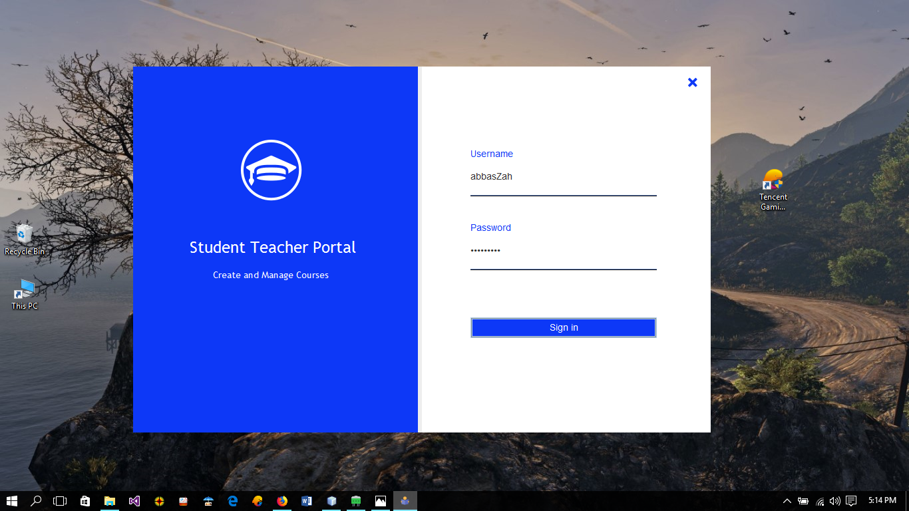
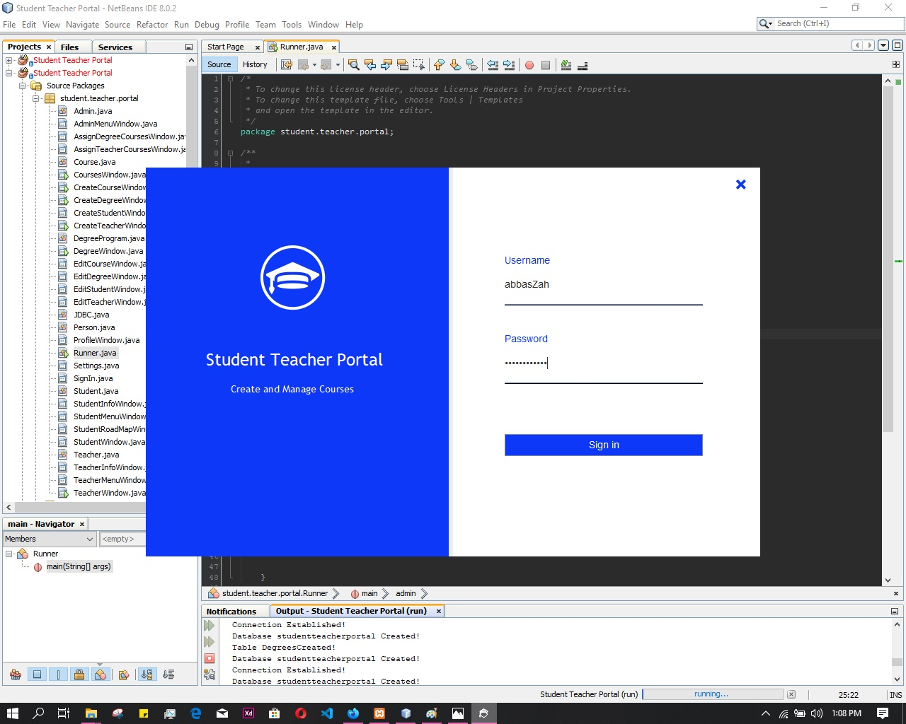
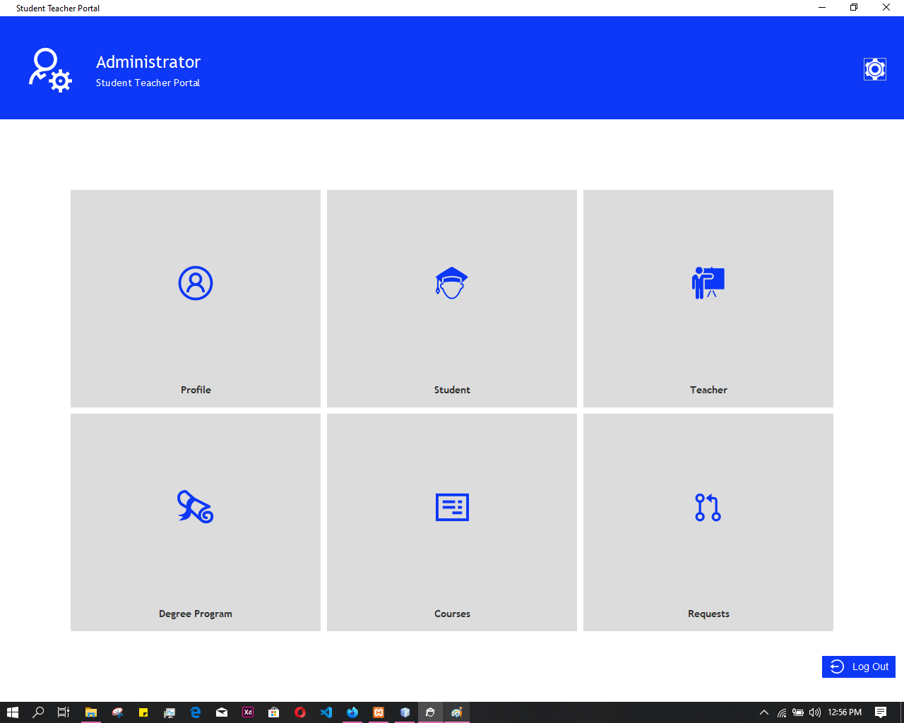

# Student Teacher Portal

A comprehensive Java-based portal system for managing student-teacher relationships, courses, and academic information.

## Features

- Admin, Teacher, and Student user roles
- Course management system
- Degree program management
- Student-teacher assignment
- User profile management
- Database integration (MySQL)

## Installation

1. **Prerequisites**:
   - Java JDK 8 or later
   - MySQL Server
   - NetBeans IDE (recommended)

2. **Database Setup**:
   - Import the database schema from `STP DB MySQl.sql`
   - Configure database connection in `JDBC.java`

3. **Build & Run**:
   - Open project in NetBeans
   - Build the project
   - Run `Runner.java` as main class

## Usage

1. Login with appropriate credentials (admin/teacher/student)
2. Navigate through the menu options
3. Manage courses, degrees, and user information based on your role

## Screenshots

## Authors

- yogesh
- krish  
- harish aravind
